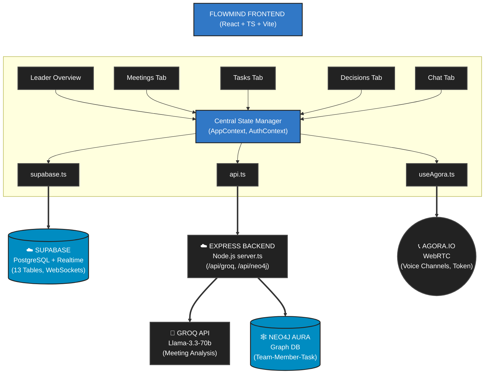
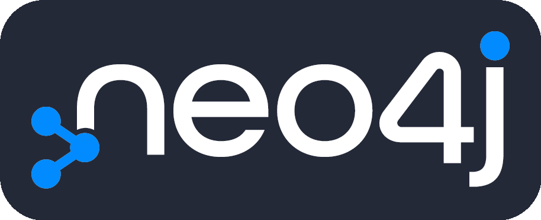
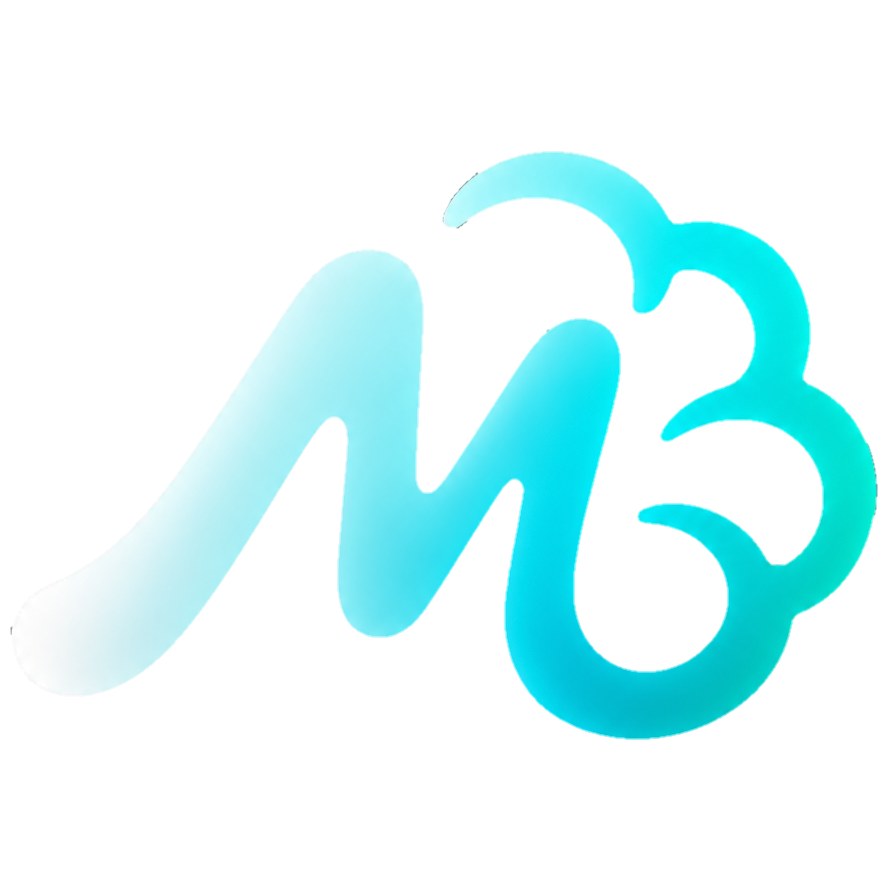

<div align="center">
  
  
  <h1>FlowMind — The PM That Never Forgets</h1>
  
  <p><strong>The AI project manager that learns your team and predicts failures before they happen.</strong></p>
  
  <p>
    <a href="https://react.dev"></a>
    <a href="https://typescriptlang.org"></a>
    <a href="https://supabase.com"></a>
    <a href="https://neo4j.com"></a>
    <a href="https://groq.com"></a>
    <a href="https://agora.io"></a>
    <br/>
    <a href="https://flowwithmind.vercel.app"></a>
    <a href="https://render.com"></a>
  </p>

  <p>
    <b>Live Demo:</b> <a href="https://flowwithmind.vercel.app">flowwithmind.vercel.app</a>
  </p>
</div>

<hr/>

<div align="center">

##  What is FlowMind?

**FlowMind** is an AI-powered project management platform that listens to your meetings, auto-assigns tasks based on member skills, and uses a **Neo4j knowledge graph** to detect bottlenecks before they derail your project.

Every team has experienced it: a productive meeting ends, everyone feels aligned, and then nothing happens. FlowMind solves this by becoming your team's persistent, intelligent project manager. It records meetings using live voice rooms, transcribes them in real-time, extracts actionable items, and monitors workload via a knowledge graph.

<br/>

##  Features

<table align="center">
  <tr>
    <td align="left"> <b>Live Voice Meetings</b> — Agora SDK WebRTC voice rooms for real-time team collaboration</td>
  </tr>
  <tr>
    <td align="left"> <b>Real-time Transcription</b> — Web Speech API with auto-reconnect capability</td>
  </tr>
  <tr>
    <td align="left"> <b>AI Meeting Analysis</b> — Groq LLM automatically extracts tasks & decisions from transcripts</td>
  </tr>
  <tr>
    <td align="left"> <b>Smart Task Assignment</b> — AI matches tasks to members based on individual skill profiles</td>
  </tr>
  <tr>
    <td align="left"> <b>Neo4j Knowledge Graph</b> — Maps team relationships, tracks workloads, and detects bottlenecks</td>
  </tr>
  <tr>
    <td align="left"> <b>AI Insights Dashboard</b> — Graph-powered bottleneck & risk detection</td>
  </tr>
  <tr>
    <td align="left"> <b>Real-time Sync</b> — Supabase Realtime for instant updates across all members</td>
  </tr>
  <tr>
    <td align="left"> <b>AI Chat Assistant</b> — Context-aware team chatbot with memory</td>
  </tr>
  <tr>
    <td align="left"> <b>Team Management</b> — Skill profiles, DMs, group chat, applications</td>
  </tr>
</table>

<br/>

##  Architecture



<br/>

##  Tech Stack

<br/>

<table>
  <tr>
    <td align="center" width="25%">
      <br/>
      <b>Frontend</b><br/>React 18 + TS + Vite
    </td>
    <td align="center" width="25%">
      <br/>
      <b>Database</b><br/>Supabase (Realtime)
    </td>
    <td align="center" width="25%">
      <br/>
      <b>Graph Database</b><br/>Neo4j Aura
    </td>
    <td align="center" width="25%">
      <br/>
      <b>Backend</b><br/>Express.js + Node.js
    </td>
  </tr>
  <tr>
    <td align="center" width="25%">
      <br/>
      <b>Artificial Intelligence</b><br/>Groq Fast Inference
    </td>
    <td align="center" width="25%">
      <br/>
      <b>Voice & WebRTC</b><br/>Agora.io SDK
    </td>
    <td align="center" width="25%">
      <br/>
      <b>Frontend Hosting</b><br/>Vercel
    </td>
    <td align="center" width="25%">
      <br/>
      <b>Backend Hosting</b><br/>Render
    </td>
  </tr>
</table>

<br/>

##  Setup & Installation

</div>

<div align="center">

### Prerequisites

 <b>Node.js 18+</b> &nbsp;&nbsp;|&nbsp;&nbsp;
 <b>Supabase</b> &nbsp;&nbsp;|&nbsp;&nbsp;
 <b>Neo4j Aura</b> &nbsp;&nbsp;|&nbsp;&nbsp;
 <b>Groq API</b> &nbsp;&nbsp;|&nbsp;&nbsp;
 <b>Agora.io</b>

</div>

### 1. Clone & Install
```bash
git clone https://github.com/piyushyenorkar/FlowMind.git
cd FlowMind

# Frontend
cd flowmind
npm install

# Backend
cd ../backend
npm install
```

### 2. Environment Variables

**Frontend** (`flowmind/.env`):
```env
VITE_SUPABASE_URL=https://your-project.supabase.co
VITE_SUPABASE_ANON_KEY=your-anon-key
VITE_BACKEND_URL=http://localhost:5000
VITE_AGORA_APP_ID=your-agora-app-id
```

**Backend** (`backend/.env`):
```env
GROQ_API_KEYS=key1,key2
HINDSIGHT_BASE_URL=https://your-hindsight-url
HINDSIGHT_API_KEY=your-hindsight-key
NEO4J_URI=neo4j+s://xxxxx.databases.neo4j.io
NEO4J_USERNAME=neo4j
NEO4J_PASSWORD=your-password
AGORA_APP_ID=your-agora-app-id
AGORA_APP_CERTIFICATE=your-agora-cert
PORT=5000
```

### 3. Neo4j Setup
Create a free Neo4j Aura instance at [neo4j.com/aura](https://neo4j.com/cloud/aura). Copy the connection URI, username, and password into your backend environment variables.

### 4. Run Locally
```bash
# Terminal 1: Backend
cd backend
npm run dev

# Terminal 2: Frontend
cd flowmind
npm run dev
```

---

<div align="center">

##  Team

Built for **HackHazards '26** by **Team Starcy**:
- Piyush (Leader)
- Debashree

<br/>


</div>


